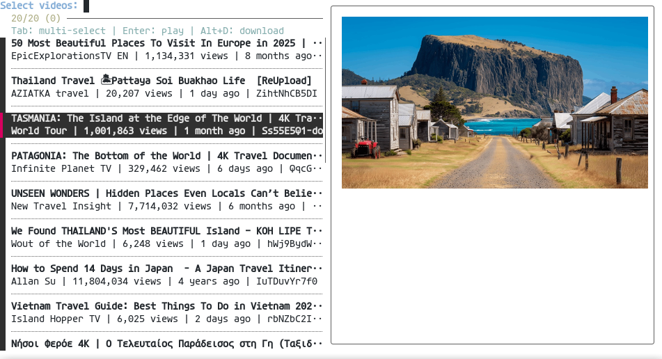

# scrapetubefzf

Search `YouTube` from the terminal, choose videos using `fzf` (with thumbnail previews), and play with `mpv` or download with `yt-dlp`.



## Installation

Clone the repository:
```bash
git clone https://github.com/gmou3/scrapetubefzf.git
cd scrapetubefzf
```

Install package and create symlink in `~/.local/bin/`:
```bash
make install
```

### Uninstall

Remove package, symlink, and clean up build artifacts:
```bash
make uninstall
```

## Usage

```bash
# Basic search with 20 results (default)
scrapetubefzf

# Search with custom number of results
scrapetubefzf -n 50

# Run mpv detached (terminal can close)
scrapetubefzf -d
```

## Requirements

- [Python](https://www.python.org/) 3.8+
- [fzf](https://github.com/junegunn/fzf) 0.56.0+
- [yt-dlp](https://github.com/yt-dlp/yt-dlp)
- [mpv](https://mpv.io/)
- One of the following for thumbnails:
  - [ueberzug](https://github.com/ueber-devel/ueberzug) or [ueberzugpp](https://github.com/jstkdng/ueberzugpp) (recommended)
  - [chafa](https://hpjansson.org/chafa/)
  - [catimg](https://github.com/posva/catimg)


